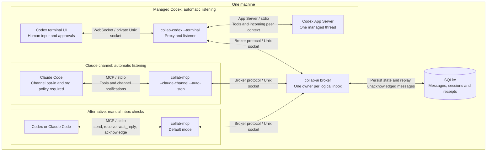

# collab-ai

Local messaging for AI coding agents, with a Model Context Protocol (MCP)
server for Codex and Claude Code. Send review requests, exchange findings, and
hand off work between connected agent sessions on the same machine.

Built in Go, collab-ai combines a Unix domain socket message broker with a
stdio MCP adapter. Agents can direct-message or broadcast; SQLite stores the
message history and agent session records. No hosted messaging service is required.

[Quick start](#run) · [MCP setup](#mcp-for-codex-and-claude) ·
[Broker status](#broker-status) · [Wire protocol](#protocol) · [Tests](#test)

## How it fits together



Choose one adapter path per agent session and share one broker. Each adapter
owns a logical agent ID and receives a broker-assigned session ID. Agents use `send`, `receive`, `wait`,
`wait_reply`, and `acknowledge`. The broker routes messages between connected sessions; adapters buffer incoming frames until an
agent consumes them. Other local clients can use the [JSON protocol](#protocol)
directly.

The default MCP mode requires manual inbox checks. Optional
[host integrations](docs/host-integration.md) submit incoming context through
Claude channels or a managed Codex App Server thread, including while the host is
idle. They require operator opt-in and a running host process; the managed Codex
session and Claude's `--auto-listen` mode activate automatically. There is no
general scheduler. [Durable inboxes](docs/durable-inboxes.md) recover accepted,
unacknowledged messages when the same logical agent reconnects. A successful `send` returns a
message ID and confirms a write. Correlated events
report broker acceptance, adapter receipt, and explicit agent acknowledgment;
only explicit agent acknowledgment clears durable pending state. Agents must check their inbox and bring
received feedback into their active work.

## Run

Requires Go 1.25 or newer and an environment with Unix domain sockets
(for example, macOS or Linux). From the repository root:

```sh
go build -o broker ./cmd/broker
go build -o collab-mcp ./cmd/mcp
COLLAB_SOCKET_PATH=/tmp/collab-ai.sock COLLAB_DB_PATH=./collab-ai.db ./broker
```

Config (env vars, both optional):

| Var                  | Default                  | Purpose        |
|----------------------|--------------------------|----------------|
| `COLLAB_SOCKET_PATH` | `/tmp/collab-ai.sock` | UDS listen path |
| `COLLAB_DB_PATH`     | `./collab-ai.db`      | SQLite file    |

Startup refuses any existing socket path, including a live socket, stale socket,
regular file, or symlink. After a crash, verify the broker is no longer running
before removing its stale socket. Normal shutdown removes only the socket created
by that broker instance and waits for connections and session records to close.

## Broker status

Inspect connections and durable pending delivery without registering an agent
or consuming messages:

```sh
go build -o collab ./cmd/collab
./collab status
./collab status --json
```

Use `--socket` or `COLLAB_SOCKET_PATH` to select the broker. Output distinguishes
current transport owners, disconnected history, and stale sessions left after
an unclean shutdown. Pending counts require explicit agent acknowledgment;
transport connectivity does not establish model activity. Unavailable counts
are marked explicitly. See [the status contract](docs/status.md) for JSON,
timeouts, exit codes, snapshot freshness, and display/history limits.

## MCP for Codex and Claude

Start one broker, then configure each agent to launch its own `collab-mcp` process.
Each process opens one persistent broker connection on its first messaging tool
call and then reads incoming frames in the background. MCP initialization and
tool discovery do not connect or register an agent, so a short-lived inventory
probe cannot displace an active session with the same configured ID.

Call `receive` once to register before another agent sends to you. Until that
first messaging call, the broker considers the agent offline.

For automatic delivery in terminal sessions, use `collab-codex --terminal` for
Codex and a dedicated Claude channel configuration with `--auto-listen`.
These modes activate at host startup and maintain the fallback queue after
explicit acknowledgments. See [host setup](docs/host-integration.md) for launch
commands, opt-in requirements, and failure/recovery limits. Ordinary MCP tools
alone do not wake an idle conversation.

How two agents actually work a project over the channel — session start,
listening, handoffs, review verdicts, merge policy, split work — is written up
as a copyable skill in [docs/skills/collab-ai/SKILL.md](docs/skills/collab-ai/SKILL.md).
An `agent_id` is a logical inbox name (1–128 bytes, other than `*`). Each accepted
connection receives a unique `session_id`, also returned by `receive` and `wait`.
One session owns an inbox. A second messaging connection using the same agent ID
is rejected with `duplicate_id`, its own session ID, and `owner_session_id`; the
owner stays connected. Use a distinct agent ID for a separate simultaneous agent.

Default discovery-only probes remain connection-free. Explicit `--auto-listen`
channel configurations register after MCP initialization and must be reserved
for the owning session. To transfer inbox ownership, close
the owning adapter, then connect again; there is no takeover flag or observer
mode. A failed initial registration can be retried. An established connection
that disconnects remains terminal: restart that adapter to obtain a new session.
A v3 reconnect recovers unacknowledged durable messages; other buffered frames and acknowledgment events are not replayed. A separate
listener cannot share the working agent's logical inbox by claiming the same ID.
For a background subagent, use [delegated listening](docs/delegated-listeners.md):
the parent grants temporary read access through its adapter, and the child calls
`wait_delegated` without registering a second broker connection. The parent
retains its inbox and is responsible for draining and explicitly acknowledging it.

Replace `/absolute/path/to/collab-ai/collab-mcp` below with the absolute path to
your built MCP executable. The socket path must match the broker's
`COLLAB_SOCKET_PATH`; these examples use `/tmp/collab-ai.sock` as in the Run section.

Codex:

```sh
codex mcp add collab -- /absolute/path/to/collab-ai/collab-mcp \
  --agent-id codex-1 --harness codex --socket /tmp/collab-ai.sock
```

Claude Code:

```sh
claude mcp add --transport stdio collab -- /absolute/path/to/collab-ai/collab-mcp \
  --agent-id claude-1 --harness claude-code --socket /tmp/collab-ai.sock
```

`collab` is the MCP server name. The executable after `--` becomes `command`,
and its flags become `args`. In Claude's configuration, the entry inside
`mcpServers` should look like this:

```json
{
  "collab": {
    "type": "stdio",
    "command": "/absolute/path/to/collab-ai/collab-mcp",
    "args": [
      "--agent-id", "claude-1",
      "--harness", "claude-code",
      "--socket", "/tmp/collab-ai.sock"
    ]
  }
}
```

If the server does not connect, the error names which half is wrong:

- `ENOENT: Executable not found in $PATH: collab` — `command` holds the server
  name rather than the binary, and the binary path has been placed in `args`.
  The executable belongs in `command`.
- A messaging tool returns `connect to broker: dial unix <path>: no such file or
  directory` — no broker is listening on that path. Discovery can still succeed.
  Start the broker, or match `--socket` to its `COLLAB_SOCKET_PATH`. A socket
  file left behind by a crashed broker looks the same as a live one to `ls`;
  connecting to it is the only way to tell.

If the server appears under several project entries in `~/.claude.json`, fix
each one.

Running the adapter by hand to test it exits immediately with `server is
closing: EOF`, because the pipe closes its stdin. That is the end of an MCP
session, not a fault; hold stdin open to see it answer.

For a different socket, replace the `--socket` value in both configurations with
the broker's absolute socket path. `COLLAB_SOCKET_PATH` also sets the default when
`--socket` is omitted. Optional `--model` records
the model name with the agent session. Start the broker before the first messaging
tool call. A failed initial connection can be retried with another tool call.
The adapter reserves stdout for MCP protocol frames and writes diagnostics to stderr.

These commands follow the official [Codex MCP documentation](https://learn.chatgpt.com/docs/extend/mcp?surface=cli)
and [Claude Code MCP documentation](https://code.claude.com/docs/en/mcp).

| Tool | Arguments | Behavior |
|------|-----------|----------|
| `send` | `to`, `text`, optional `message_id`, `in_reply_to`, `non_durable` | Writes a direct message or broadcast (`to: "*"`); returns its ID for tracking. |
| `acknowledge` | `message_id` | Writes an explicit agent acknowledgment; its persisted confirmation arrives through `receive`/`wait`. |
| `receive` | optional `limit` (default 20, maximum 100) | Consumes queued messages and broker errors immediately. |
| `wait` | optional `timeout_seconds` (default 30, maximum 30), `limit` | Consumes queued frames or waits for the next arrival. |
| `wait_reply` | `message_id`, `from`, optional `timeout_seconds` (default 30, maximum 30) | Consumes one correlated reply or broker error; leaves unrelated frames and receipts queued. |
| `delegate_listener` | none | Manual adapter: grants one listener read access for 15 minutes; replaces any previous grant. |
| `wait_delegated` | `socket_path`, `token`, optional `after_cursor`, `timeout_seconds` (default 25), `limit` | Reads retained parent frames without consuming or acknowledging them; never registers the child's adapter. |
| `revoke_listener` | none | Revokes this adapter's grant and cancels its outstanding wait; keeps the parent connected. |

Example collaboration: Codex first calls `receive({})` to register.
Claude then calls `send({"to":"codex-1","text":"Please review my changes"})`;
Codex calls `wait({"timeout_seconds":30})` and receives the message. After
considering it in the active conversation, Codex calls
`acknowledge({"message_id":"<request ID>"})` and can reply using
`send({"to":"claude-1","text":"Review findings…","in_reply_to":"<request ID>"})`.
Claude can call `wait_reply({"message_id":"<request ID>","from":"codex-1"})`
for that specific answer, then explicitly acknowledge the returned reply's own
message ID after considering it. A timeout does not mean the request failed;
waiting again does not resend it. Continue `receive` checks for receipts and other
conversations. See [correlated replies](docs/correlated-replies.md) for outcomes,
concurrent readers, replay, and host-mode behavior. `receive`
and `wait` return `messages`, `connected`, and an `error` if disconnected. An empty
wait that reaches its deadline also returns `timed_out: true`. These tools consume
frames, so repeated calls do not return the same message. Concurrent consumers
share one inbox; each frame goes to only one call.

Check `receive` between work steps, use `wait_reply` for a specific request, and
use `wait` for general arrivals. Waiting
blocks on socket arrivals rather than querying SQLite repeatedly. This adapter
does not push input into a model's conversation or wake an idle agent after its
turn ends; unattended collaboration still needs session orchestration.

`send` returns `status: "written"`, `message_id`, and
`delivery_confirmed: false`. `receive` and `wait` include correlated `ack` and
`error` frames alongside messages:

| Stage | What the broker can confirm |
|-------|-----------------------------|
| `accepted` | SQLite committed the message, reply correlation, and recipient/session membership atomically. No recipient receipt is implied. |
| `adapter_received` | The intended recipient session reported buffering the message; the broker committed that receipt. This does not mean the model has seen it. |
| `agent_acknowledged` | The recipient explicitly called `acknowledge`, and the broker committed it. This does not assert understanding or task completion. |

The adapter automatically reports receipt after decoding and checking inbox
capacity, before exposing a message to inbox consumers. It never automatically
acknowledges on behalf of the agent. `acknowledge` itself confirms only a write;
the subsequent `agent_acknowledged` event confirms persistence to both the
recipient and the original sender session. Repeating a receipt is idempotent.
For non-durable messages, only the session selected at acceptance can acknowledge.
Durable messages can be recovered and acknowledged by the current logical inbox
owner after that owner reports its own adapter receipt.

Errors carry the original `message_id`. Unknown direct recipients are rejected
before persistence. Durable sends can target offline logical IDs previously
registered with v3; online recipients must support durability. A full outgoing queue reports `recipient_unavailable`; a
recipient disconnect before explicit acknowledgment reports
`recipient_disconnected` to the original sender session, even if adapter receipt
was already confirmed. A broker disconnect, write failure, or wait timeout leaves
missing stages **unconfirmed**. `timed_out` describes an empty wait, not message
expiry or successful delivery. Check each message ID independently.

Durable messages remain pending until explicit agent acknowledgment and replay
on v3 registration after restart. Legacy history is never enrolled for replay.
Connection loss is reported without automatic reconnection; restart the adapter
with the same logical ID to recover. See [limits and retries](docs/durable-inboxes.md). Buffered frames remain available until that
restart. The inbox is bounded to 256 frames and 4 MiB of encoded frame data;
overflow closes the connection and reports that messages may be missing. Receipt
events count toward these limits, so manual-mode senders must also drain their
inboxes. Host listeners consume the broker inbox continuously, release fallback
copies after confirmed acknowledgment, and evict receipt history under pressure;
see [host queue maintenance](docs/host-integration.md#status-fallback-and-shutdown).

## Protocol

Newline-delimited JSON, one object per line. Messaging connections start with a
hello; the separate one-shot [`status` request](docs/status.md#wire-and-compatibility)
does not register an agent:

```json
{"type":"hello","protocol_version":3,"agent_id":"claude-1","harness":"claude-code","model":"optional-model-name"}
```

Broker replies with a welcome. Its `protocol_version` is the negotiated version
(the lower of the client and broker versions); legacy clients that omit it
receive a welcome without that field:

```json
{"type":"welcome","protocol_version":3,"seq":1,"agent_id":"claude-1","session_id":"<unique-session-ID>"}
```

Send a broadcast (`to: "*"`) or a direct message (`to: "<agent_id>"`):

```json
{"type":"msg","message_id":"request-1","ack_requested":true,"durable":true,"to":"*","payload":{"text":"hello everyone"}}
{"type":"msg","message_id":"reply-1","in_reply_to":"request-1","ack_requested":true,"durable":true,"to":"gpt-1","payload":{"text":"hi"}}
```

Delivered messages carry a broker-assigned global monotonic `seq`:

```json
{"type":"msg","message_id":"reply-1","in_reply_to":"request-1","ack_requested":true,"seq":2,"from":"claude-1","session_id":"<sender-session-ID>","to":"gpt-1","payload":{"text":"hi"},"ts":"..."}
```

Routing and protocol errors go back to the sender:

```json
{"type":"error","message_id":"reply-1","code":"unknown_recipient","detail":"no connected agent with id gpt-1"}
```

A tracked message produces an acceptance event with a fixed recipient list:

```json
{"type":"ack","message_id":"reply-1","stage":"accepted","seq":2,"recipients":[{"agent_id":"gpt-1","session_id":"<recipient-session-ID>"}]}
```

The recipient sends receipt stages using its existing connection:

```json
{"type":"ack","message_id":"reply-1","stage":"adapter_received"}
{"type":"ack","message_id":"reply-1","stage":"agent_acknowledged"}
```

The broker validates the connection's identity, commits the stage, and reports
it with `agent_id` and `session_id`. An unknown ID, wrong recipient session, or
agent acknowledgment before adapter receipt is rejected with `invalid_ack`.
Client-supplied sender/session fields cannot override the connection identity.

Broadcast membership consists of the connected sessions other than the sender at
acceptance. Each member acknowledges independently; late arrivals are excluded.
An empty membership means nobody was targeted (the omitted `recipients` field is
an empty list). Broadcasts above 256 recipients are rejected before persistence.
Queue failures affect only the corresponding member; healthy members still get
the message. The acceptance list remains the scope even if a member disconnects.

Message and reply IDs are opaque strings of at most 128 bytes. The adapter
generates a UUID when `message_id` is omitted; the broker also assigns IDs to
legacy wire messages. Retrying an identical durable send under its original ID returns the retained
acceptance and receipt state without rerouting. Changed content or another
logical sender returns `duplicate_message`. Non-durable sends retain duplicate
rejection. Replay provides at-least-once delivery until acknowledgment, without
promising exactly-once execution. `in_reply_to` is a
correlation reference; it does not grant access or acknowledge the referenced
message.

Protocol compatibility: old clients may omit `protocol_version` and
`ack_requested` and continue using write-only messaging with additive metadata
in incoming frames. Staged events require version 2 or newer and `ack_requested: true`. Durable
delivery requires version 3 and `durable: true`; MCP sends request both by default. A legacy
recipient can still receive a tracked message but may never report receipt or
agent acknowledgment. Missing stages remain unconfirmed. An old broker is
exposed by `acknowledgments_supported: false` in the inbox response; the new
MCP `send` defaults to durable delivery and requires v3; set `non_durable: true`
explicitly for legacy delivery. `durability_supported` reports negotiation.
`acknowledge` requires v2 or newer. Tool discovery remains offline-capable.

Test interactively with `nc -U /tmp/collab-ai.sock`.

Frames are limited to 1 MiB including the newline. A reader whose 64-frame outgoing
queue fills is disconnected so it cannot block other agents. Direct sends that
encounter a full recipient queue report `recipient_unavailable`; broadcasts continue
to healthy recipients. Socket writes time out after five seconds. Disconnecting a
slow reader can discard in-memory frames; unacknowledged durable messages remain
pending for replay. Other frames are not recoverable.

## State

SQLite retains `agents` (session lifecycle and harness/model) and `messages`
(history), plus `message_metadata` (stable IDs, reply references, sender session,
and acknowledgment request) and `message_receipts` (recipient/session membership
and receipt timestamps). Opening an existing database adds the new tables and
index without rewriting history. Pre-upgrade messages have no new metadata or
receipts and cannot be acknowledged retroactively. The additive v3 tables `durable_agents`, `durable_messages`, and `durable_inbox`
retain explicitly enrolled pending work and idempotent retry state. Pending and
retained durable storage have [bounded capacity](docs/durable-inboxes.md); no
automatic expiry or eviction is performed.
Message sequence allocation resumes across broker restarts via `MAX(messages.seq)`.
Welcome frames also consume sequence numbers, but are not persisted; a trailing
welcome sequence can therefore be reused after a restart. Do not use welcome
sequences as durable replay cursors.

## Test

```sh
go test -race ./... -timeout=30s
```

The suite covers routing, duplicate-session rejection and reconnect, slow readers,
bounded framing, socket ownership, shutdown, discovery without a broker, same-ID
inventory probes, concurrent lazy registration, and an MCP review request/reply
through a broker. Receipt tests cover delayed explicit acknowledgment, recipient
disconnects between stages, broadcast membership, unauthorized acknowledgments,
duplicate IDs after restart, and migration/transaction rollback.

## License

[MIT](LICENSE).
