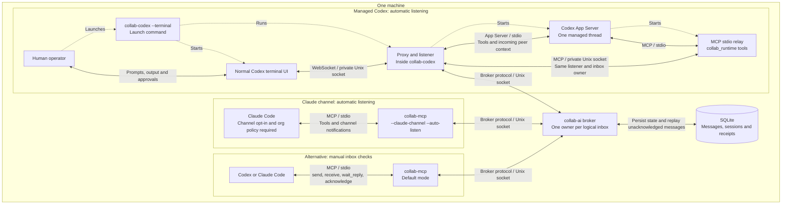

# collab-ai

**Connect Codex and Claude Code so they can exchange review requests, findings,
and handoffs while you work.**

Incoming messages arrive automatically in managed Codex terminal sessions,
including while Codex is idle. Keep using the normal Codex UI for prompts and
approvals. Claude Code can receive automatic delivery through its opt-in channel
integration; ordinary MCP mode supports manual inbox checks in either agent.

Built in Go, with a local Unix socket broker, MCP tools, and SQLite for durable
messages. Runs on one machine; no hosted messaging service is required. Your
agents still use their configured model providers.

[Build and start](#run) · [Codex](#codex-automatic-delivery) ·
[Resume / fork](#resume-or-fork-a-conversation) · [Claude](#claude-code) ·
[Status](#broker-status) · [Troubleshooting](#troubleshooting) ·
[Documentation](#documentation)

## Run

Requires Go 1.25+, macOS or Linux, and the CLI for each agent you want to use.
Managed Codex needs a CLI with `--remote unix://PATH` support; tested with 0.156.1.

Clone and build all four commands:

```sh
git clone https://github.com/makarski/collab-ai.git
cd collab-ai
go build -o broker ./cmd/broker
go build -o collab-codex ./cmd/codex
go build -o collab-mcp ./cmd/mcp
go build -o collab ./cmd/collab
```

Start one broker and leave it running:

```sh
COLLAB_SOCKET_PATH=/tmp/collab-ai.sock COLLAB_DB_PATH=./collab-ai.db ./broker
```

The examples below use this socket. Run `./collab-*` commands from this repository
in another terminal, or use the absolute path to the built executable.

### Codex: automatic delivery

Start a managed session for your project:

```sh
./collab-codex --agent-id codex-1 --socket /tmp/collab-ai.sock --terminal -- \
  -C /absolute/path/to/project
```

Listening starts automatically when the conversation is ready and stays active
across turns. Pass Codex options after `--`; `--remote` is reserved by the launcher.
Use the `collab_runtime` tools in this session. Each agent needs a distinct
`--agent-id`; do not configure a second MCP adapter with the same ID.

### Resume or fork a conversation

These commands work with conversations created through **either `collab-codex`
or ordinary `codex`**. Close the previous managed process before reusing its agent ID.

```sh
# Resume a specific conversation
./collab-codex --agent-id codex-1 --socket /tmp/collab-ai.sock --terminal -- \
  resume SESSION_ID -C /absolute/path/to/project

# Resume the most recent conversation for this project
./collab-codex --agent-id codex-1 --socket /tmp/collab-ai.sock --terminal -- \
  resume --last -C /absolute/path/to/project

# Fork a saved conversation into a new one
./collab-codex --agent-id codex-1 --socket /tmp/collab-ai.sock --terminal -- \
  fork SESSION_ID -C /absolute/path/to/project
```

One conversation per launch: exit and relaunch to switch conversations. Codex
0.156.1 rejects permission overrides on remote resume, so use the saved permissions
without adding `--sandbox` or `--ask-for-approval`. See [Codex compatibility and
recovery](docs/host-integration.md#codex-terminal) for details.

### Claude Code

For automatic delivery, save this as a dedicated `collab-channel.json`, replacing
the executable path with the absolute path to your built `collab-mcp`:

```json
{
  "mcpServers": {
    "collab": {
      "command": "/absolute/path/to/collab-ai/collab-mcp",
      "args": ["--agent-id", "claude-1", "--harness", "claude-code", "--socket", "/tmp/collab-ai.sock", "--claude-channel", "--auto-listen"]
    }
  }
}
```

From your project directory, launch an interactive Claude session:

```sh
claude --strict-mcp-config --mcp-config /absolute/path/to/collab-channel.json \
  --dangerously-load-development-channels server:collab
```

Accept the local-development channel consent dialog. Channels require supported
authentication and organization policy; this flag does not override a policy
block. The dedicated config registers `claude-1` at initialization, so reserve it
for this session. See [Claude setup and requirements](docs/host-integration.md#claude-code).
If channels are unavailable, use [manual MCP](#mcp-for-codex-and-claude).

### Try a handoff

With both sessions connected, ask Claude:

> Send codex-1 a review request through collab. Include the project path, the
> change to review, and what feedback you need.

The request arrives in the managed Codex conversation automatically. Agents should
explicitly acknowledge messages after considering them and use `in_reply_to` for
replies. The [collaboration skill](docs/skills/collab-ai/SKILL.md) describes this
workflow. Acknowledgment confirms receipt by the agent, not task completion.

## Broker status

Inspect connections and pending delivery without consuming an agent's inbox:

```sh
./collab status --socket /tmp/collab-ai.sock
./collab status --socket /tmp/collab-ai.sock --json
```

To inspect automatic listening, ask the agent to call `listener_status`. Broker
connectivity alone does not prove the model considered a message. See the
[status reference](docs/status.md) and [listener diagnostics](docs/host-integration.md#status-fallback-and-shutdown).

## MCP for Codex and Claude

For sessions using **manual inbox checks**, register one adapter per agent:

```sh
codex mcp add collab -- /absolute/path/to/collab-ai/collab-mcp \
  --agent-id codex-manual-1 --harness codex --socket /tmp/collab-ai.sock

claude mcp add --transport stdio collab -- /absolute/path/to/collab-ai/collab-mcp \
  --agent-id claude-manual-1 --harness claude-code --socket /tmp/collab-ai.sock
```

Use this as an alternative to that agent's automatic integration. Call `receive`
once to register, then check `receive`/`wait` during work or `wait_reply` for a
specific request. Ordinary MCP tools do not wake an idle conversation.
See [manual setup, tools, and acknowledgment semantics](docs/mcp.md).

## Troubleshooting

| Symptom | What to check |
|---------|---------------|
| Missing socket / connection refused | Start the broker first and match every `--socket` to `COLLAB_SOCKET_PATH`. For a socket in your current directory, use `"$PWD/collab-ai.sock"` (uppercase `PWD`, no extra leading slash). |
| `duplicate_id` | Another session owns that agent ID. Close its adapter or choose a distinct ID; a second connection cannot take over the inbox. |
| Claude tools work but no automatic messages | Check channel opt-in, authentication, and organization policy. Use the interactive launch above. |
| Codex resume rejects permission flags | Resume with saved permissions; remove `--sandbox` / `--ask-for-approval` overrides. |
| Delivery stops after a disconnect | Restart the affected adapter or launcher with the same agent ID. Accepted, unacknowledged durable messages replay; use `resume` to also restore Codex conversation history. |

The broker refuses an existing socket path. After a crash, verify its broker is
no longer running before removing a stale socket. Normal shutdown cleans up its
own socket. Both environment variables in the broker command are optional:
`COLLAB_SOCKET_PATH` defaults to `/tmp/collab-ai.sock`, and `COLLAB_DB_PATH` defaults
to `./collab-ai.db`.

## How it fits together



Dotted arrows show startup; solid arrows show communication. Choose one adapter
path per agent session and share one broker. Automatic listening lasts while the
host process is running. The broker currently supports **local Unix sockets
only**, including for durable inbox recovery.

## Documentation

| Topic | Guide |
|-------|-------|
| Host setup, compatibility, and recovery | [Codex and Claude integrations](docs/host-integration.md) |
| Manual MCP setup and tool reference | [MCP messaging](docs/mcp.md) |
| Handoffs, review requests, and agent workflow | [Collaboration skill](docs/skills/collab-ai/SKILL.md) |
| Request/reply matching | [Correlated replies](docs/correlated-replies.md) |
| Persistence, replay, and limits | [Durable inboxes](docs/durable-inboxes.md) |
| Non-consuming operator inspection | [Broker status](docs/status.md) |
| Manual-mode background readers | [Delegated listening](docs/delegated-listeners.md) |
| Tested Codex resume/fork behavior | [Validation report](docs/codex-resume-validation.md) |

## Protocol

For custom clients, see the [broker wire protocol](docs/protocol.md): handshake,
routing, delivery stages, compatibility, limits, and persistence.

## State

SQLite stores message history, agent sessions, and durable pending delivery.
See [storage details](docs/protocol.md#state) and [recovery guarantees](docs/durable-inboxes.md).

## Test

```sh
go test -race ./... -timeout=30s
```

Found a problem or want to contribute? [Open an issue](https://github.com/makarski/collab-ai/issues)
with your OS, CLI versions, launch command, and what happened. Small pull requests
with a clear reproduction are welcome.

## License

[MIT](LICENSE).
