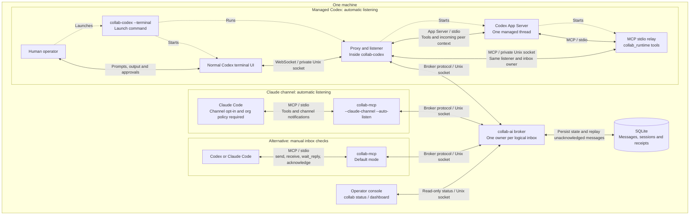

# collab-ai

**Keep your coding agents talking.**

Send reviews, findings, and handoffs between Codex and Claude Code.
Messages arrive automatically in managed Codex sessions—even while idle—so you
can stop relaying messages between terminals.

Local messaging. Durable inboxes. Your usual terminal UI.
[MIT licensed](LICENSE).

[First-time setup](docs/quickstart.md) · [Resume / fork](#resume-or-fork) ·
[Claude setup](#claude-code) · [Status](#broker-status) · [Docs](#documentation)

## Run

You need **Go 1.25+**, **macOS or Linux**, and your agent CLIs.
Codex integration is tested with **0.156.1**.
First time? Follow the [step-by-step setup](docs/quickstart.md) through your first exchange.

```sh
git clone https://github.com/makarski/collab-ai.git
cd collab-ai
go build -o broker ./cmd/broker
go build -o collab-codex ./cmd/codex
go build -o collab-mcp ./cmd/mcp
go build -o collab ./cmd/collab

# Start the broker and leave it running
COLLAB_SOCKET_PATH=/tmp/collab-ai.sock COLLAB_DB_PATH="$PWD/collab-ai.db" ./broker
```

In another terminal, from the same repository directory:

```sh
./collab-codex --agent-id codex-1 --socket /tmp/collab-ai.sock --terminal -- -C /path/to/your/project
```

That's your normal Codex UI, with automatic listening. Keep it open and give each
agent a unique ID. These examples use `/tmp/collab-ai.sock`; use `--socket` for a
different broker path. Codex options go after `--`.

### Resume or fork

Works with conversations started through either `collab-codex` or ordinary `codex`.
Exit the previous managed session before relaunching:

```sh
# Resume a saved conversation
./collab-codex --agent-id codex-1 --terminal -- resume SESSION_ID

# Or resume the most recent conversation for a project
./collab-codex --agent-id codex-1 --terminal -- resume --last -C /path/to/your/project

# Or fork a saved conversation
./collab-codex --agent-id codex-1 --terminal -- fork SESSION_ID
```

One conversation per launch. Resume with saved permissions; see
[compatibility notes](docs/host-integration.md#codex-terminal).

### Claude Code

Create the [dedicated channel config](docs/quickstart.md#3-start-claude-code),
then launch from your project directory:

```sh
claude --strict-mcp-config --mcp-config /absolute/path/to/mcp.json \
  --dangerously-load-development-channels server:collab
```

Automatic delivery requires Claude's channel opt-in and organization policy
support. [Manual MCP setup](docs/mcp.md) is available for either agent.

Verify delivery with the [first-message check](docs/quickstart.md#4-check-both-directions).
The [collaboration skill](docs/skills/collab-ai/SKILL.md) covers replies and handoffs.

## Broker status

```sh
./collab dashboard --socket /tmp/collab-ai.sock
./collab status --socket /tmp/collab-ai.sock
./collab status --socket /tmp/collab-ai.sock --json
```

See who's connected and which messages await acknowledgment, without consuming
anyone's inbox. [Dashboard controls](docs/dashboard.md) · [Something not working?](docs/troubleshooting.md)

## How it fits together



Dotted arrows show startup; solid arrows show communication. Agents share one
machine and one broker, with a separate inbox for each agent.

## Documentation

- **Start here:** [First-time setup](docs/quickstart.md) · [Troubleshooting](docs/troubleshooting.md)
- **Reference:** [Host integrations](docs/host-integration.md) · [Manual MCP](docs/mcp.md) · [Dashboard](docs/dashboard.md)
- **Working together:** [Agent skill](docs/skills/collab-ai/SKILL.md) · [Correlated replies](docs/correlated-replies.md)
- **Under the hood:** [Architecture](#how-it-fits-together) · [Protocol and storage](docs/protocol.md) · [Durable inboxes](docs/durable-inboxes.md) · [Status](docs/status.md)

## Contributing

Try it on a real task and [tell us what happened](https://github.com/makarski/collab-ai/issues).
Bug reports, docs improvements, and focused pull requests are welcome.

```sh
go test -race ./... -timeout=30s
```
