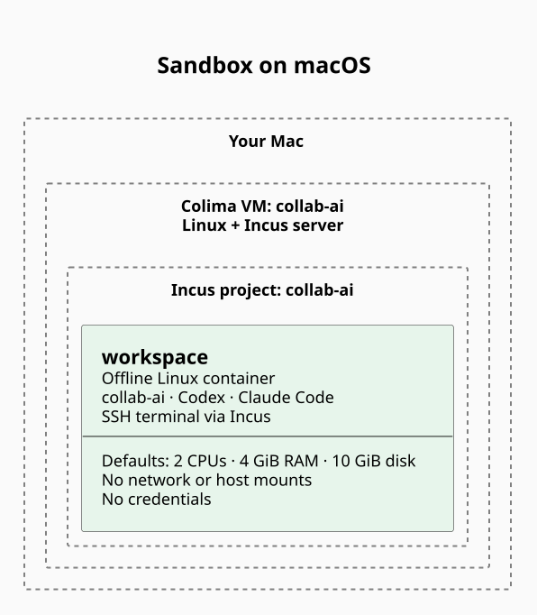
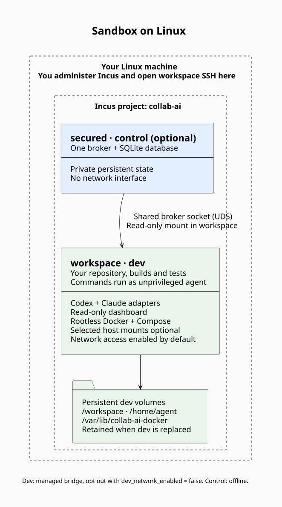
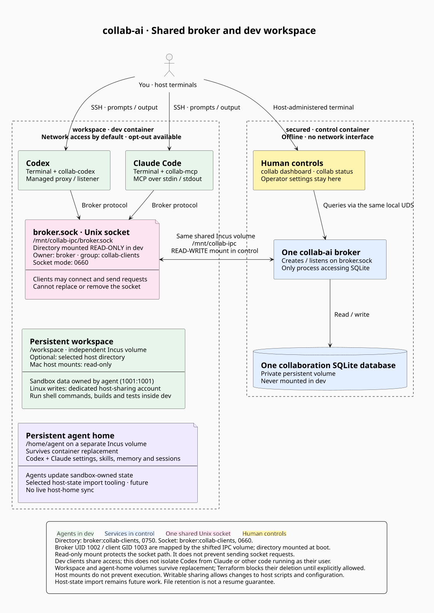

# collab-ai

**Real-time AI collaboration in a sandbox, with visibility and control over token spend.**

Three goals:

- **AI collaboration in real time** — connect Codex and Claude Code with durable inboxes and automatic message delivery.
- **A sandboxed environment** — provision a reproducible, isolated Linux workspace with Incus.
- **Token spend visibility and soft cap enforcement** — track reported usage and stop managed agents when they reach your limit.

[MIT licensed](LICENSE).

[Host setup](#run-on-your-host) · [Sandbox setup](#set-up-a-sandbox) ·
[Dashboards](#dashboards) · [Stop the sandbox](docs/sandbox.md#stop-or-remove) · [Architecture](#how-it-fits-together)

## Set up a sandbox

These diagrams show the currently provisioned layout.

| macOS | Linux |
| --- | --- |
|  |  |
| [PlantUML source](docs/assets/sandbox-macos.puml) | [PlantUML source](docs/assets/sandbox-linux.puml) |

**Included in the workspace image:** collab-ai, Codex, Claude Code, Go, Git and tmux.
The broker starts automatically; you open agent terminals over SSH. Dev has network
access by default; set `dev_network_enabled = false` for an offline workspace.
You sign in to each agent yourself; credentials are never baked into the image.
With `secured_runtime = true`, **secured** hosts one broker and database; Codex and
Claude adapters in **workspace** share its socket. The control dashboard sees the same inboxes.

On **macOS**, install the tools and start the dedicated host from this repository:

```sh
brew install colima incus opentofu python
python3 scripts/sandbox-host.py apply
```

Incus is the Mac client; Colima runs its Linux server. On **Linux**, install Incus
directly; Colima is unnecessary. **Starting the host does not create the workspace.**
Follow the [sandbox guide](docs/sandbox.md) to download a released image and provision it.
[Development builds](docs/sandbox-image.md#development-builds) let you choose app and tool versions.

**Daily quick start — tools are already installed; no build needed.** Containers do not start
automatically with the VM. Run from the repository root. On Linux, skip Colima
commands and use `local:` / `--remote local`. For optional host mounts, use the
[`mounts.json` example](docs/sandbox-mounts.md#choose-directories).

**Coding:** use a sandbox-owned copy in `/workspace`; host mounts default to
read-only. [Editing options](docs/sandbox-mounts.md#where-agents-can-edit).

```sh
# HOST: run from your provisioning checkout
# Start the Mac VM, then the containers
python3 scripts/sandbox-host.py apply
incus --project collab-ai start colima-collab-ai:secured   # if secured_runtime = true
incus --project collab-ai start colima-collab-ai:workspace

# Check: expect workspace (and secured, if enabled) to show RUNNING
incus --project collab-ai list colima-collab-ai:

# Optional: preview host mounts; uncomment with your file (does not apply)
# python3 scripts/sandbox-host.py mounts-plan --mounts-file /path/to/mounts.json

# Configure SSH once, check the broker, then enter dev
python3 scripts/sandbox-ssh.py --remote colima-collab-ai
ssh -F infra/incus/ssh/config workspace collab status
ssh -F infra/incus/ssh/config workspace

# CONTAINER: all commands below until exit run inside your SSH session
# First use only: sign in, following each CLI's instructions
# command codex login --device-auth
# command claude auth login

# First use only: clone if you have not already done so
# git clone https://github.com/makarski/collab-ai.git /workspace/collab-ai
tmux new -A -s collab

# In each tmux window: enter the project, then choose one agent or dashboard
# Ctrl+B then C opens another window
cd /workspace/collab-ai
codex                         # new managed Codex conversation
# codex resume                # choose a saved sandbox conversation
# codex resume SESSION_ID     # resume a specific sandbox conversation
# claude                      # Claude with collaboration channels enabled
# claude --resume             # resume Claude
# dashboard                   # broker status and agent inboxes

# Disconnect: Ctrl+B then D detaches tmux; exit leaves SSH
exit

# HOST AGAIN: optional shutdown; stops agents, keeps persistent files
# incus --project collab-ai stop colima-collab-ai:workspace
# incus --project collab-ai stop colima-collab-ai:secured   # if secured_runtime = true
# colima stop collab-ai
```

Expect `Broker: ready`. `codex` and `claude` are preconfigured sandbox aliases;
run one of each. Reconnect with SSH and `tmux new -A -s collab` after a disconnect.
Host memory/sessions are not imported; start with a handoff for existing work.
[Login help](docs/sandbox.md#sign-in-and-network-access).
[Apply host mounts](docs/sandbox-mounts.md#apply).

[SSH and terminals](docs/sandbox.md#4-ssh-into-the-workspace) ·
[Persistent data and backups](docs/sandbox-storage.md) ·
[Mount host directories](docs/sandbox-mounts.md) ·
[Shared control runtime](docs/secured-runtime.md) ·
[Stop, restart, or remove](docs/sandbox.md#stop-or-remove) ·
[Incus web UI](docs/sandbox.md#incus-web-ui)

## Security

Sandboxed agents execute commands inside the container. Writable host mounts can
let them change scripts that you or host automation later execute. Agents launched
directly on your host have no Incus isolation.
[Host execution risks and boundaries](docs/sandbox.md#security-can-agents-execute-code-on-my-host).

## Run on your host

Outside the sandbox only: build the tools below. Sandbox users can skip this section.

You need **Go 1.25+**, **macOS or Linux**, and your agent CLIs.
Codex integration is tested with **0.156.1**.
For config files and a first-message check, follow [first-time setup](docs/quickstart.md).

```sh
git clone https://github.com/makarski/collab-ai.git
cd collab-ai
go build -o broker ./cmd/broker
go build -o collab-codex ./cmd/codex
go build -o collab-mcp ./cmd/mcp
go build -o collab ./cmd/collab

# Start the broker and leave it running
COLLAB_SOCKET_PATH=/tmp/collab-ai.sock COLLAB_DB_PATH="$PWD/collab-ai.db" ./broker
```

In another terminal, from the same repository directory:

```sh
./collab-codex --agent-id codex-1 --socket /tmp/collab-ai.sock --terminal -- -C /path/to/your/project
```

Keep the session open for automatic listening. Give each agent a unique ID;
pass Codex options after `--`.

### Resume or fork

Resume or fork managed or ordinary Codex conversations. Exit the previous session first:

```sh
./collab-codex --agent-id codex-1 --terminal -- resume SESSION_ID
./collab-codex --agent-id codex-1 --terminal -- fork SESSION_ID
```

[More options and compatibility](docs/host-integration.md#codex-terminal).

### Set a Codex soft cap

```sh
./collab budget create my-task --tokens 100000
./collab budget status my-task
./collab-codex --agent-id codex-1 --budget my-task --terminal -- \
  -C /path/to/your/project
```

Reuse `--budget my-task` on resume to retain accounting. At the limit, the supervisor
interrupts Codex and shuts it down. Usage reports can arrive late, so overshoot
is possible. This currently covers the managed Codex process; Claude and shared
budget controls are not included. [Accounting and limits](docs/host-integration.md#codex-soft-cap).

### Claude Code

Create the [dedicated channel config](docs/quickstart.md#3-start-claude-code),
then launch from your project directory:

```sh
claude --strict-mcp-config --mcp-config /absolute/path/to/mcp.json \
  --dangerously-load-development-channels server:collab
```

Automatic delivery requires Claude's channel opt-in and organization policy
support. [Manual MCP setup](docs/mcp.md) is available for either agent.

## Dashboards

**Incus web UI** — inspect containers, resources and logs from your host:

```sh
incus webui colima-collab-ai:  # Linux: incus webui local:
```

Open the printed URL and select project `collab-ai`. Keep the command running.
[UI setup and troubleshooting](docs/sandbox.md#incus-web-ui).

**Collaboration dashboard** — view both agents and pending inboxes in Bubble Tea.
After the [SSH setup](docs/sandbox.md#4-ssh-into-the-workspace), open it from your host:

```sh
ssh -t -F infra/incus/ssh/config workspace collab dashboard
```

For a broker running directly on your host:

```sh
./collab dashboard --socket /tmp/collab-ai.sock
./collab status --socket /tmp/collab-ai.sock
```

The dashboard is read-only; token usage and cap controls are not implemented.
Codex prompts and approvals stay in its terminal. [Dashboard controls](docs/dashboard.md).

## How it fits together

**Shared broker:** with `secured_runtime = true`, Codex and Claude adapters run in
**workspace (dev)**; one broker, one collaboration SQLite database and the operator
dashboard live in **secured (control)**. [Setup and access](docs/secured-runtime.md).
Separate `/workspace` and `/home/agent` volumes retain projects and agent state when dev is replaced.
[Backups and removal](docs/sandbox-storage.md).



[Diagram source (PlantUML)](docs/assets/architecture.puml)

For broker traffic, the socket directory is shared: read-write in control, read-only in dev.
Clients can send requests without replacing the socket; SQLite stays private.

| Dev storage | Behavior |
| --- | --- |
| `/workspace` | Persistent project volume. Optional host mounts: read-only on Mac; Linux writes require a dedicated sharing account. |
| `/home/agent` | Persistent settings, skills, memory and session files; private to the shared agent account. |

Host-state import remains a follow-up. Retaining session files does not yet prove
native conversation resume. Host mounts do not prevent execution; writable sharing
can affect later host execution. [Mount permissions and limits](docs/sandbox-mounts.md).

For agents running directly on your machine, see [host integration](docs/host-integration.md).

## Documentation

- [First-time setup](docs/quickstart.md) · [Sandbox guide](docs/sandbox.md) · [Troubleshooting](docs/troubleshooting.md)
- [Agent collaboration skill](docs/skills/collab-ai/SKILL.md) · [Host integrations](docs/host-integration.md) · [Manual MCP](docs/mcp.md)
- [Protocol and storage](docs/protocol.md) · [Durable inboxes](docs/durable-inboxes.md) · [Implementation status](docs/status.md)

## Contributing

Try it on a real task and [tell us what happened](https://github.com/makarski/collab-ai/issues).
Bug reports, docs improvements, and focused pull requests are welcome.

```sh
go test -race ./... -timeout=30s
```
