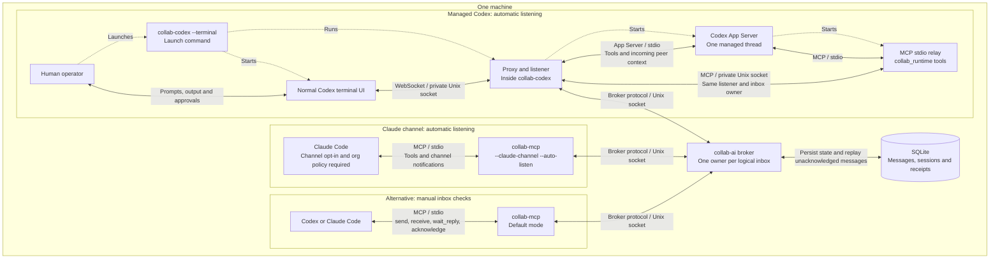

# Architecture

[Back to the README](../README.md).

Dotted arrows show startup; solid arrows show communication. Choose one adapter
path per agent session and share one broker. Automatic listening lasts while the
host process is running. The broker currently supports **local Unix sockets
only**, including for durable inbox recovery.

See [host integration](host-integration.md) for lifecycle and compatibility details,
and the [wire protocol](protocol.md) for broker routing and storage.
