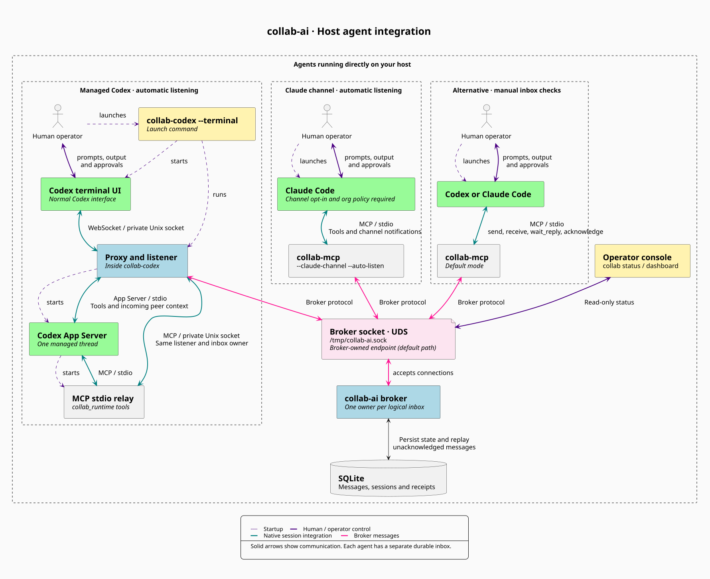

# Host integration

This is the ordinary host setup. For the proposed two-container layout, see the
[sandbox architecture](../README.md#how-it-fits-together).



[Diagram source (PlantUML)](assets/host-integration.puml)

For a first installation, follow the [step-by-step setup](quickstart.md).
The [README](../README.md#run) keeps everyday launch, resume, fork, and status
commands handy.

The default MCP adapter remains a manual inbox. Two opt-in integrations can
submit peer context to a running host: a Claude Code channel and an App Server
proxy for a single Codex thread, including the normal Codex terminal UI. The
broker still uses UDS. Both modes use [durable inbox recovery](durable-inboxes.md)
for accepted v3 messages. Neither listens after its process stops. The listener
lifetime is independent
of model turns and context compaction; host scheduling still determines when
the model sees submitted context.

For a background subagent using the manual adapter, use
[delegated listening](delegated-listeners.md). It shares the parent's inbox
through an explicit read-only capability and preserves the parent's broker
ownership. Creating delegation is separate from the host integrations below;
channel/proxy listeners already have their own consumer. A delegated reader
still needs its host to relay results or wake its parent.

## Claude Code

Build `go build -o collab-mcp ./cmd/mcp`. Add `--claude-channel --auto-listen`
to a dedicated MCP configuration for the owning session:

```json
{
  "mcpServers": {
    "collab": {
      "command": "/absolute/path/to/collab-mcp",
      "args": ["--agent-id", "claude-1", "--socket", "/tmp/collab-ai.sock", "--claude-channel", "--auto-listen"]
    }
  }
}
```

For this locally developed server, start an **interactive** Claude session:

```sh
claude --strict-mcp-config --mcp-config /absolute/path/to/mcp.json \
  --dangerously-load-development-channels server:collab
```

Read and accept Claude's local-development consent dialog. With `--auto-listen`,
the adapter activates when that MCP session sends `notifications/initialized`;
Claude does not need to call `listen`. Keep that same Claude process running.
The channel uses the session-based MCP handshake; stateless `server/discover`
probes are rejected so clients negotiate `initialize`/`initialized`.

Use `--auto-listen` only in a dedicated session configuration: any process that
initializes that configuration attempts registration, including an inventory
probe. Default MCP and channel mode without `--auto-listen` stay passive until
a messaging/`listen` call. `--auto-listen` requires `--claude-channel`. A failed
automatic registration is logged to stderr and exposed by `listener_status`;
resolve the cause, then retry `listen` or restart. Duplicate IDs never displace
the existing owner.

The adapter advertises `experimental["claude/channel"]` and emits
`notifications/claude/channel`; it does **not** advertise permission relay.

Channels are a research preview with host version, authentication/provider,
organization policy, and per-session opt-in requirements. Current Claude docs
permit claude.ai or Console API-key authentication, with additional managed
organization restrictions. The development flag does not override organization
policy. On the tested Claude Code 2.1.272, the custom development flag is ignored
in `-p` mode: MCP tools work but the channel does not deliver. Use the interactive
development flow above. Approved production plugins have a separate `--channels`
flow; this repository is not an approved plugin.

Claude can silently ignore a successfully written notification. Therefore
`listening_delivery_unconfirmed` and `submitted` are submission observations,
never claims that Claude read a message. Explicit `acknowledge` tool calls,
confirmed by the broker, establish the acknowledgment boundary. A reply can use
`in_reply_to` for correlation, but does not implicitly acknowledge.

## Codex terminal

Build `go build -o collab-codex ./cmd/codex`, then launch your terminal session:

```sh
./collab-codex --agent-id codex-1 --socket /tmp/collab-ai.sock --terminal -- \
  -C /absolute/path/to/project
```

This starts the installed Codex terminal UI with `codex --remote` through a
private Unix socket, then connects it to the managed App Server proxy. Arguments
after `--` go to the terminal UI, including model, working directory, sandbox,
and approval options; the launcher reserves `--remote`. Existing Codex settings
still apply. No global configuration is changed and no TCP listener is opened.
The temporary socket lives in a mode-0700 directory and is removed on exit.

`collab-codex` is the launch command for managed sessions; the normal Codex UI
remains the interface for your prompts, output, and approvals. Maintaining Codex
argument compatibility is a launcher requirement: forward arguments after `--`
unchanged and let the installed Codex CLI parse them, while keeping launcher
options before the separator. The only reserved Codex option is `--remote`,
which selects the proxy connection. Argument forwarding does not guarantee
support for every Codex workflow; the session limitations below still apply.

Resume an existing conversation, including one originally created with ordinary
`codex`, or fork it into a new conversation:

```sh
./collab-codex --agent-id codex-1 --socket /tmp/collab-ai.sock --terminal -- \
  resume SESSION_ID -C /absolute/path/to/project
./collab-codex --agent-id codex-1 --socket /tmp/collab-ai.sock --terminal -- \
  resume --last -C /absolute/path/to/project
./collab-codex --agent-id codex-1 --socket /tmp/collab-ai.sock --terminal -- \
  fork SESSION_ID -C /absolute/path/to/project
```

Codex owns session selection, history loading, and argument parsing. Close the
previous owner before resuming a conversation here. The proxy binds the thread
ID returned by Codex; a fork receives its own ID. Use the same broker agent ID
to recover that inbox's durable messages, or a distinct ID for a separate agent.

The tested Codex CLI 0.156.1 rejects permission overrides such as `--sandbox`
and `--ask-for-approval` when resuming a remote task. Resume with the saved
permissions; the launcher forwards those flags unchanged and does not silently
discard them. Complete any Codex folder-trust prompt before expecting listening
to activate. Use ordinary `codex` for commands unrelated to an interactive
managed conversation, such as login, configuration management, or `exec`.

Tools come from a required, session-local `collab_runtime` MCP server, connected
through a stdio relay and a private Unix socket to the proxy's existing listener.
It does not open another broker connection. This runtime configuration is
injected into start/resume/fork requests and regenerated on every launch; no
global MCP configuration is edited. The `collab_runtime` server name is reserved;
requests supplying `config["mcp_servers.collab_runtime"]` are rejected explicitly.
Use its tools for managed collaboration; an independently configured manual
collab adapter is a different connection and must not claim the same inbox ID.
Legacy `collab_*` dynamic tools restored from older managed conversations still
use the same listener. Resume/fork preserve saved developer instructions unless
the caller explicitly supplies a replacement.

Start the broker first. Listening begins after a successful start, resume, or fork,
without a broker registration prompt or `listen` call. The terminal remains the
operator approval interface. A failed automatic registration terminates the
managed session with an error instead of leaving apparently working comms.
Exiting the terminal stops the proxy and its App Server child.

For a broker socket in your current directory, pass `--socket "$PWD/collab-ai.sock"`
(uppercase `PWD`, without an extra leading slash). The launcher checks that the
socket path exists and is a Unix socket before opening the UI; this does not
guarantee that a broker is still serving it. A missing or incorrect path is
reported directly in the shell. Cancellation sends SIGTERM to Codex first so
an npm launcher can forward shutdown to its native child, with a two-second
fallback timeout for the launched process.

Each launcher process manages **one conversation**, started, resumed, or forked.
To switch conversations with `/new`, `/resume`, or `/fork`, exit and launch a new
process instead. It does not attach to a terminal already running. The CLI must
support `--remote unix://PATH` (available in the locally tested 0.156.1).

### Codex soft cap

Create a budget once, then select it by name when launching or resuming Codex:

```sh
collab budget create my-task --tokens 100000
collab budget status my-task --json
collab-codex --agent-id codex-1 --budget my-task --terminal -- resume SESSION_ID
```

`collab budget status` shows the cap, reported tokens, remaining allocation from
reports, overshoot, last report time and accounting errors. It works while Codex
is running. A new budget explicitly says no usage has been reported; the displayed
remaining amount is based on observations, not a real-time provider balance.
An old timestamp can mean an idle session or delayed reporting; status does not
claim to know which. No broker or model connection is needed for these commands.

Budgets live in `~/.local/state/collab-ai/budgets`. Set `COLLAB_BUDGET_DIR` to the
same absolute directory for both commands to use another location. Named budgets
must be created explicitly; repeating `create` never resets usage or changes a
cap. Each currently supports one managed Codex launcher, not simultaneous agents.
Keep the files across restarts; destroying a sandbox also destroys budgets stored
only on its root disk.

The inline form remains supported: `--token-cap 100000 --budget-file
/absolute/path/task-budget.json`, before `--`. Create its parent directory first.
Use either `--budget NAME` or the two inline flags; combining them is rejected.
Omitting all budget options leaves the session uncapped. Existing subscription
authentication and native approvals are unchanged.

The supervisor records App Server `thread/tokenUsage/updated` cumulative
`totalTokens`, once per reported thread, in a private JSON file. It does not add
cached-input or reasoning subtotals again. These are native-client token counts,
not dollars, subscription quota, RTK savings estimates or a provider billing audit.
The file's `threads` values are the observed high-water marks; their sum is the
recorded spend. A missing report is unknown usage, not evidence of zero spend.

Reuse the **same named budget**, or the same inline file and cap, after restarting or resuming. Duplicate reports
never add charges. A lower reported total stops the session, since it could mean
a counter reset; it never refunds tokens. Reported history from an ordinary resumed session
is included; a fork's new thread ID counts separately, including any history
Codex reports for it. The file supports one launcher at a time and refuses cap
changes or relaunch after exhaustion. A new file deliberately starts a separate
budget. Keep budget files outside repositories and do not delete them to resume
the same task.

At the observed limit, the proxy rejects new operator requests and peer-triggered
turns, requests `turn/interrupt`, then ends the session after two seconds. The App
Server process group receives SIGTERM, followed by SIGKILL after another two
seconds if needed. The shell diagnostic shows reported usage, cap and overshoot;
late usage received during interruption is still recorded. Durable unacknowledged
peer messages remain recoverable through the broker. Pending work is not retried.

Malformed usage or a persistence error also stops the session. Inspect the error
and reconcile unknown usage before starting a new budget. Accounting failures are
saved when storage permits; a storage failure or crash can lose the latest report.

**This is a soft guardrail.** Delayed or absent reports, internal calls and work
already running remotely can overshoot; there is no proven maximum overshoot.
Unreported subagent or auxiliary usage is not covered. A local account can bypass
the wrapper, change its files or launch detached processes; this is not a sandbox
security boundary: an agent with the same write access can also change its own cap.
Protecting a human-set ceiling requires enforcement and budget storage outside
the agent's writable environment, with separate permissions; this version does
not provide that separation. Claude supervision and shared budget splits are not yet
available. Tests use offline protocol/process fixtures; no live subscription
spending was used to validate the cap.

For a separately protected launcher, `--budget-status-socket /absolute/path/status.sock`
publishes one named budget through a read-only Unix API. The existing parent
directory must belong to the launcher and must not be group/world writable.
Expose only this directory to the workload, read-only; retain the launcher,
budget files and administration outside its filesystem and process access.
Inside the workload, `collab budget status NAME --socket /mounted/status.sock --json`
reads that endpoint without opening local budget storage. A missing endpoint is
an error. The socket has no create, reset, report-usage or cap-update operations.
This is visibility only; stopping remains the protected launcher's responsibility.
See the [offline two-container proof](budget-boundary.md) for tested cases and limits.

The broker transport remains UDS; WebSocket framing here is only the CLI's local
App Server connection. Keep the manual MCP setup for ordinary `codex` sessions
that do not use this launcher; that setup still requires inbox checks.

A normal Codex control session can run alongside a managed session. If both
connect to the broker, give them distinct agent IDs: each ID has exactly one
active inbox owner. Messages delivered to the managed thread do not wake or
update the separate control conversation. Restarting the proxy with the same
agent ID recovers unacknowledged durable broker messages. Use `resume` to also
recover the selected conversation's history; a new thread has no old history.

## Codex App Server clients

Build `go build -o collab-codex ./cmd/codex`. An App Server client can launch:

```sh
./collab-codex --agent-id codex-1 --socket /tmp/collab-ai.sock
```

The executable launches `codex app-server --listen stdio://` and speaks the App
Server protocol on stdin/stdout. It is a proxy for an operator-owned client, not
a terminal chat UI. Use `--codex /absolute/path/to/codex` to choose the executable.

The client initializes with `capabilities.experimentalApi: true`, sends
`initialized`, and selects one thread with `thread/start`, `thread/resume`, or
`thread/fork`. The proxy adds the required runtime MCP configuration. The caller's
existing dynamic tools, sandbox, approval policy, and other thread parameters are
preserved. Legacy `collab_` names remain reserved for restored collaboration
tools. A failed lifecycle request can be retried; selecting a second conversation
needs a new proxy process. Existing running desktop conversations are not attached
or controlled by this integration.

Operator request IDs must not start with `collab-`; that namespace is reserved
for injected requests. Replies arriving after an injected request times out are
consumed internally. Operator responses to host approval requests pass through
regardless of their ID.

After the successful thread lifecycle response is forwarded to the client, the
proxy activates listening automatically. Its internal MCP tool discovery stays
passive. Start normal operator work using `turn/start`. Incoming frames enter
the managed thread with:

```json
{
  "method": "turn/start",
  "params": {
    "threadId": "<managed-thread-id>",
    "input": [],
    "toolOutput": {"name": "collab_receive", "output": "<encoded peer frame>"}
  }
}
```

The host contract queues external tool output during active work and starts a
turn when idle. The proxy never promotes peer content to user instructions and
never turns an API response into an agent acknowledgment. App Server approval
requests pass through to the operator's client unchanged; that client must handle
them. Collaboration peers cannot answer them through the broker.

## Status, fallback, and shutdown

One listener owns the broker connection and consumes its frames. Messaging tools
share that owner. `receive`/`wait` drain a separate bounded copy, so they cannot
steal a frame from host submission. Only message and error frames are submitted;
acknowledgment events remain in the fallback inbox to avoid endless wake cycles.
`wait_reply` selectively consumes one correlated reply/error from that same copy,
preserving host submission and unrelated frames. It is exposed as
`wait_reply` through `collab_runtime` (or restored legacy `collab_wait_reply`).
See [correlated replies](correlated-replies.md)
for outcomes and deduplication across host notifications and tool results.
The runtime removes a copied peer message only after the broker confirms this
receiving session's explicit `agent_acknowledged`. Successful host submission,
acknowledgment writes, and receipts from other sessions cannot remove it. An
already acknowledged reply may therefore be absent from a later `wait_reply`.

Receipt frames are bounded diagnostic history. Under frame or byte pressure,
the oldest receipts are evicted first; an incoming receipt is dropped if only
protected messages/errors remain. `receipts_dropped` is a cumulative counter in
`listener_status` and inbox results, including `wait_reply`. It is not a complete
receipt ledger; a missing receipt is not proof of failed delivery. Unacknowledged
messages and broker errors are never evicted to make room for receipts.

For healthy host delivery of acknowledgment-capable messages, periodic `receive`
drains are unnecessary. Use `receive` for diagnostics, broker receipt inspection,
legacy messages without acknowledgments, and recovery when Claude ignores a
notification. Message and error backlogs remain bounded and can still overflow
if nobody handles them.

`listener_status` returns `inactive`, `listening_delivery_unconfirmed`,
`disconnected`, or `stopped`, the broker session ID, submission count, last
submitted message ID, buffered frame/byte counts, receipt eviction count, and any error. `manual_check_required` stays true: neither
host's write response proves conversation exposure. Verify each tracked message
through its correlated `accepted`, `adapter_received`, and explicit
`agent_acknowledged` events. Acknowledgment means the agent considered the context,
not that it completed a task.

The broker client's inbox and listener copy each allow 256 frames / 4 MiB.
Receipts count toward the copy limit but are evicted under pressure. A protected
message/error overflow, a failed host submission, or an
established broker disconnect stops the listener, reports a possible gap in
status, and logs it to stderr.
Unconsumed copied frames remain readable until process exit. There is no silent
reconnect. Restart obtains a new broker session and loses in-memory frames;
accepted durable messages without agent acknowledgment replay to the same
logical ID on v3. Other history and ephemeral frames are not replayed. Initial
connection failures can be retried. Deduplicate stable IDs before repeating work.

The App Server proxy accepts host frames up to 32 MiB to accommodate large
plugin inventories. This does not change the broker's 1 MiB peer-frame limit.

Host submissions have a five-second deadline. Waiting tools use the existing
30-second maximum. Cancellation closes a potentially partial host write; EOF or
shutdown closes the managed process and releases inbox ownership. The production
listener waits on events, without polling the database.

## Validation and host references

`go test -race ./... -timeout=30s` covers the wire contract, concurrency, explicit
acknowledgments, retained fallback, inactive discovery, foreign-thread tool calls,
approval pass-through, unavailable hosts, overflow, and cancellation. Fake-host
tests cannot establish whether a particular installed host actually wakes.

The dynamic-tool response shape is checked against Codex 0.154.0's generated
`DynamicToolCallResponse` schema: `success` and `contentItems`, with text entries
using `type: "inputText"` and `text`. Tests exercise the full tool handler path,
validation failures, RPC errors, and late replies after cancellation.

The [recorded live handoff](host-live-demo.md) demonstrates all four cases on
Claude Code 2.1.272 and Codex CLI 0.154.0, with message, conversation, broker
session, and explicit acknowledgment identities.

The [automatic terminal lifecycle run](managed-comms-live-demo.md) records
Codex CLI 0.156.1 and the observed Claude organization-policy blocker.

Host contracts: [Claude channels](https://code.claude.com/docs/en/channels),
[channel reference](https://code.claude.com/docs/en/channels-reference), and
[Codex App Server](https://learn.chatgpt.com/docs/app-server#start-a-turn).
