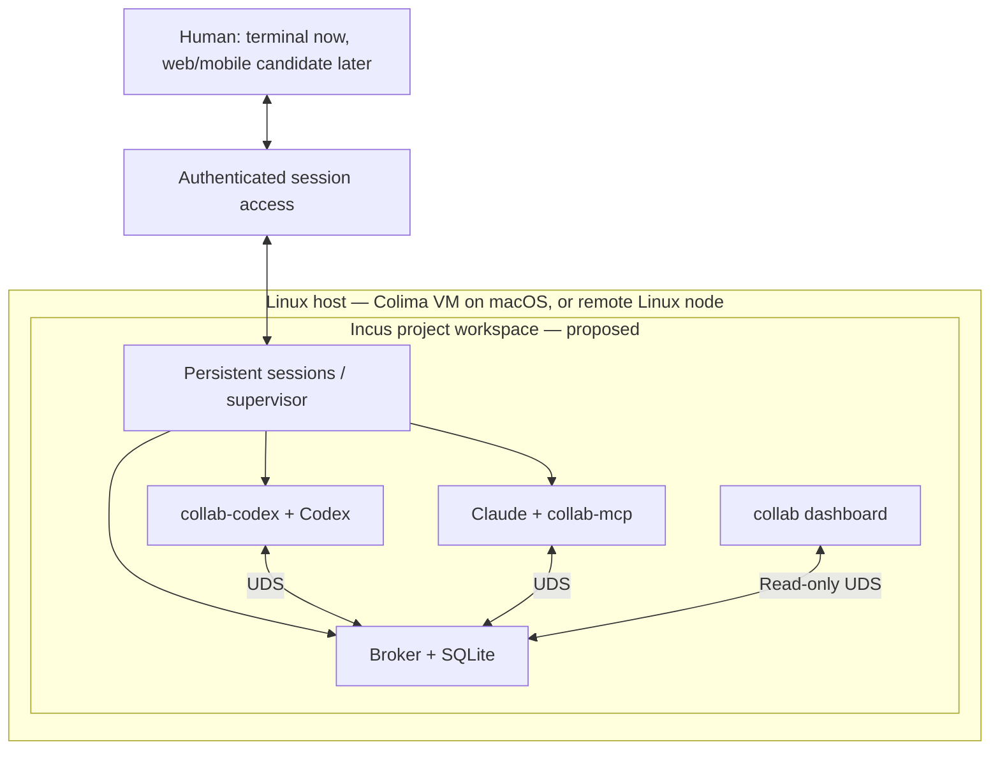

# Remote workspaces: reuse, gaps, and a sandbox direction

Research snapshot: **2026-09-25**. This is a proposal, not an implemented setup.
External capabilities below come from project documentation; compatibility with
collab-ai has not been tested. Start with the [local setup](quickstart.md) today.

The experience to aim for: open a workspace, talk to Claude or Codex, see their
handoffs, answer approvals, and reconnect later while their sessions keep running.
The code and agent processes live inside a sandbox you control.

## What we already have

| Need | Current collab-ai capability | Remaining gap |
|---|---|---|
| Agents exchange work | Broker, durable inboxes, explicit acknowledgments, correlated replies | Delivery history is not yet exposed as a read-only operator timeline |
| Codex receives while idle | Managed App Server proxy and session-local MCP tools | Listener ends when its managed process exits |
| Claude receives while idle | Interactive channel adapter | Host/account policy can block delivery; SDK delivery needs separate validation |
| Return to a conversation | Managed Codex start/resume/fork, including ordinary saved conversations | Resume is not attachment to an already running desktop conversation |
| Inspect collaboration | Read-only status and Bubble Tea dashboard | No human chat, approval controls, or workspace lifecycle UI |
| Bound autonomous token use | No enforced token budget | Hard combined and per-agent caps are a prerequisite for the unattended experiment |
| Run remotely | All components can run together on a remote Linux machine | No remote broker transport or sandbox provisioning |

See [host integration](host-integration.md), [durable inboxes](durable-inboxes.md),
and [dashboard](dashboard.md) for the implemented boundaries.

## Existing remote-session options

The last column is our integration assessment, not a claim that upstream lacks
every feature we might need. Supporting both agents does not establish support
for our managed listeners or inbox ownership rules.

| Option | Documented functionality | Fit and question to test |
|---|---|---|
| [Claude Remote Control](https://code.claude.com/docs/en/remote-control) | Controls a running local Claude session through Claude's web/mobile interfaces; local files and MCP remain available | Fastest native Claude surface. Test it on the channel-owning session. It could direct Codex through collab messages, but that gives indirect control, not a combined agent interface. Account and organization eligibility still apply. |
| [Codex remote connections](https://learn.chatgpt.com/docs/remote-connections) | Native remote control, approvals, and desktop SSH projects; the app starts an App Server on the SSH host | Useful native Codex surface. We have not established a supported way for it to launch through our proxy or attach to its managed thread. Direct startup could bypass automatic collaboration. |
| [SSH + tmux](https://github.com/tmux/tmux/wiki) | Detached terminal programs keep running and can be reattached | Best initial baseline: run the existing launchers inside the workspace and preserve their UI/approval behavior. Reconnection alone does not restart crashed agents or provide a combined event view. |
| [Happy](https://github.com/slopus/happy) | Web/mobile clients for both agents, permission notifications, encrypted sync, and its own CLI wrappers | Strong candidate for remote interaction. Its README describes restarting a session when switching to remote mode: test listener shutdown/restart, MCP injection, inbox ownership, and history continuity. Do not assume nesting wrappers works. |
| [CloudCLI / Claude Code UI](https://github.com/siteboon/claudecodeui) | Web/mobile interface for both agents, session management, terminal, files, Git, UI/backend plugins, and an experimental Docker sandbox mode | Strong candidate for an existing web shell. Check whether a plugin can launch our proxy and dedicated Claude config, preserve approvals, and display broker events without competing inbox consumers. |
| [Vibe Kanban](https://github.com/BloopAI/vibe-kanban) | Agent workspaces, task planning, diff review, and application previews | Useful reference for task/review UX. The company announced its shutdown and a community-maintained local direction; do not depend on its former hosted remote service. Worktree separation alone is not a process sandbox. |
| Our UI using [Codex App Server](https://learn.chatgpt.com/docs/app-server) and [Claude Agent SDK](https://code.claude.com/docs/en/agent-sdk/overview) | Official integration interfaces for agent sessions, events, tools, and permissions | Gives the most control, with the largest maintenance burden. Codex can use our existing stdio proxy. Claude needs a deliberate host adapter; the interactive channel launch cannot simply be assumed to work in SDK/headless mode. |

Claude Remote Control is a vendor-hosted remote surface; its documented flow
does not establish an embeddable API for our own browser application. The Agent
SDK is the documented route for embedding Claude's agent runtime. Likewise,
Codex's App Server is an integration interface, while native remote connections
are an existing user-facing product. SDK account/authentication requirements and
costs need validation; do not assume terminal subscriptions transfer unchanged.

Vibe Kanban's [April 10, 2026 announcement](https://www.vibekanban.com/blog/shutdown)
states that hosted remote services would end after 30 days while local workspaces
would continue. Treat it as a design reference or evaluate the community version
on its current merits.

CloudCLI also offers a sandbox route, so compare its documented experimental
mode with the Incus recipe before building provisioning into collab-ai. For an
upstream integration, prefer a plugin or process boundary; review the chosen
project's license before copying implementation code into this MIT repository.

**Recommendation:** first use SSH/tmux as the compatibility baseline, then test
CloudCLI for a combined web interface and Happy for mobile access. Build a custom
surface only after those trials identify a specific integration gap. The useful
collab-ai contribution is reliable cross-agent handoffs and their visibility.
This baseline is eligible for unattended testing only once the hard-budget
requirements below are proven; persistent terminals alone do not enforce them.

## Hard token caps: required before unattended work

The experiment must enforce a numeric token cap for the whole run and a separate
cap for each agent, outside model instructions. Choose the values before any live
run; there is no unlimited default. A warning, turn count, dollar estimate, or
instruction to stop is not a hard token ceiling. This requirement is not yet
implemented in collab-ai.

Count cumulative input and output tokens across every model request, including
repeated context, cache reads/writes, reasoning, compaction, retries, and subagents.
Normalize provider fields so cached tokens or reasoning already included in a
total are not added twice. Context-window occupancy is not cumulative usage.
Unmetered auxiliary model calls must be disabled or covered by the same budget.

Enforcement must meet these conditions:

- **Reserve before dispatch.** Every model request needs an atomic reservation
  against both the agent and shared budget, covering a proven upper bound on
  input plus provider-enforced maximum output. Concurrent requests share the
  same ledger. Refuse requests whose bound does not fit. A turn can contain many
  requests, so admission at `turn/start` alone is insufficient.
- **Cover every execution path.** Automatic peer delivery, retries, compaction,
  forks, child agents, and model calls launched through tools cannot bypass the
  gate. The sandbox must prevent alternate credentials or direct provider access
  from bypassing enforcement. Agents cannot change their limits or ledger.
- **Persist the budget.** Reconnects, crashes, process restarts, and conversation
  resets do not replenish it. Reconcile usage once per request; do not double
  count cumulative reports. Keep uncertain in-flight reservations charged until
  final usage is known. Missing telemetry or an unavailable ledger blocks further
  requests rather than granting more budget.
- **Stop without overshoot.** Reserved in-flight requests may finish within their
  bounds; cancellation does not guarantee that provider-side generation stops
  or refunds a reservation. At exhaustion, latch the run as budget-exhausted and
  prevent further model work. Incoming messages remain pending; do not fabricate
  acknowledgments. Keep operator status accessible. Only an explicit human budget
  change may authorize additional work; reconnecting is not authorization.

Runtime documentation currently establishes useful accounting/control primitives,
but not this end-to-end guarantee:

| Interface | Documented primitive | Why it does not establish our hard cap |
|---|---|---|
| [Claude CLI](https://code.claude.com/docs/en/cli-reference) | `--max-budget-usd` and `--max-turns` in print mode | Dollars/turns differ from tokens; these flags do not establish enforcement for our interactive channel session or a shared cross-agent ledger |
| [Claude Agent SDK usage](https://code.claude.com/docs/en/agent-sdk/cost-tracking) | Per-step and result usage; whole-tree accounting requires the appropriate fields | Accounting is not pre-dispatch admission, and incomplete/late usage cannot bound in-flight work |
| [Codex App Server](https://learn.chatgpt.com/docs/app-server) | `thread/tokenUsage/updated` events and `turn/interrupt` | Observing consumption then interrupting can overshoot; these primitives alone do not prove a strict aggregate ceiling |

A provider-enforced allowance or a request gateway could supply the enforcement
boundary, but its exact token semantics and compatibility must be verified.
If a native CLI or subscription route cannot expose enforceable bounds for all
requests, it is **ineligible for the hard-capped experiment**. SDK or API access
alone is not proof either. Revisit the host integration rather than silently
substituting a best-effort watchdog.

Acceptance tests must force exhaustion during concurrent requests, delayed usage,
retries, and a restart. Total completed usage plus outstanding reservations must
never exceed either configured cap. Reject bypass attempts, preserve queued
messages and session history, and verify that UI reconnection does not resume
budget-exhausted work. Prove this with a controlled provider fixture before any
live unattended run.

## Sandbox shape

Colima already documents an [Incus runtime](https://colima.run/docs/runtimes/#incus).
On macOS, use a dedicated Colima profile hosting Incus; on Linux, run Incus
directly. Start with one unprivileged system container per project workspace,
containing both agents and the broker. Incus
[system containers share the host kernel](https://linuxcontainers.org/incus/docs/main/explanation/containers_and_vms/);
they do not provide the same isolation boundary as separate VMs.

This isolates the workspace from the host; it does **not** isolate the two agents
from each other. Use separate worktrees for independent edits. Keep sockets,
SQLite, and agent session state inside the Linux workspace. A mounted macOS
directory does not by itself provide a cross-VM Unix-socket connection.

The sandbox profile should expose only selected project data and required
credentials. Colima documents [disabling host mounts](https://colima.run/docs/configuration/#disabling-mounts);
avoid inheriting broad home-directory access in the sandbox recipe. Agent
permissions still apply inside the container. Keep the Incus management socket
and workspace-management credentials outside the agents' reach.

Remote operator access and remote broker transport solve different problems.
The first gives the human access to sessions; the second connects agents on
different machines. A remote Linux node on a Tailscale network could host the
whole workspace with UDS unchanged. A separate broker node would still need a
new authenticated transport or an explicitly managed bridge.

## Smallest useful experiment

**Entry gate:** implement and validate the hard token caps above, including the
chosen runtime's request boundary, then set explicit numeric limits. Until then,
limit work to setup, read-only investigation, and controlled fixtures; do not run
the detached live-agent experiment.

1. Create a separate Colima/Incus profile with explicit mounts, resources, and
   persistent workspace storage. Record versions and configuration. Start with
   system containers; nested VMs are unnecessary for this first experiment.
2. Run the current broker, managed Codex, interactive Claude channel, and
   dashboard inside one workspace. Use persistent terminal sessions initially.
   Validate provider login and Claude channel policy before evaluating UI options.
3. Detach and reconnect while exchanging a request, correlated reply, and explicit
   acknowledgments. Verify that there is still one owner per inbox and no need
   for a human to remind an idle agent to check messages.
4. Repeat through a candidate remote interface. Test a pending approval, UI
   disconnect, agent crash, broker restart, and ordinary-conversation resume.
   Record exactly what survives and what must be relaunched. A running listener
   is not proof of delivery into the model's conversation.
5. Keep the successful recipe as a reproducible setup. Add a supervisor only with
   explicit start/stop/recovery rules: closing a browser must not end a session;
   stopping a workspace must; failed turns must not be silently resubmitted.

The initial spike succeeds when the existing collaboration behavior survives
operator disconnects inside the sandbox **without exceeding either token cap**.
A combined UI succeeds when it also
routes prompts and approvals to the correct workspace/agent/session, preserves
history, and cannot confuse a broker acknowledgment with a human authorization.

For a future web service, separate workspace-management operations from agent
execution. Bind access locally for the first prototype; remote access needs
authentication, workspace authorization, and an approval/reconnect protocol.
Keep management capabilities out of the agent environment.

## How this relates to the issue list

- [#19: read-only message inspection](https://github.com/makarski/collab-ai/issues/19)
  is the next reusable broker feature: any terminal or web UI needs it to show
  exchanges without draining an agent's inbox.
- [#20: delivery timelines](https://github.com/makarski/collab-ai/issues/20) can build
  on that API in the existing dashboard; the same data can serve a later web UI.
- [#21: audited disconnect](https://github.com/makarski/collab-ai/issues/21) concerns
  exact broker-session ownership. It is not a substitute for stopping an agent
  process or a workspace.
- [#22: automatic communications lifecycle](https://github.com/makarski/collab-ai/issues/22)
  still needs the complete live Claude/Codex validation. Remote access or a
  sandbox does not remove the Claude channel-policy constraint.

The sandbox/remote-interface experiment is proposed follow-up work. No sandbox,
web server, third-party integration, or new broker transport ships with this doc.
